<div align="center">

# Resort Management System✨

## ✨ [Live Preview](https://darshan-Resort-management-system.netlify.app/)

<div align='center'>
<h3>Home Section</h3>
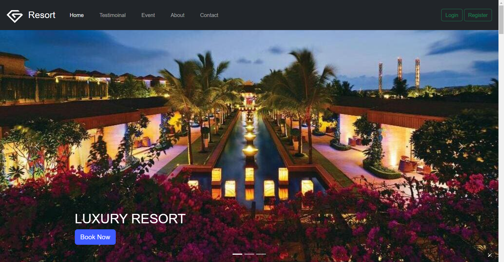
<h3>Booking Section</h3>
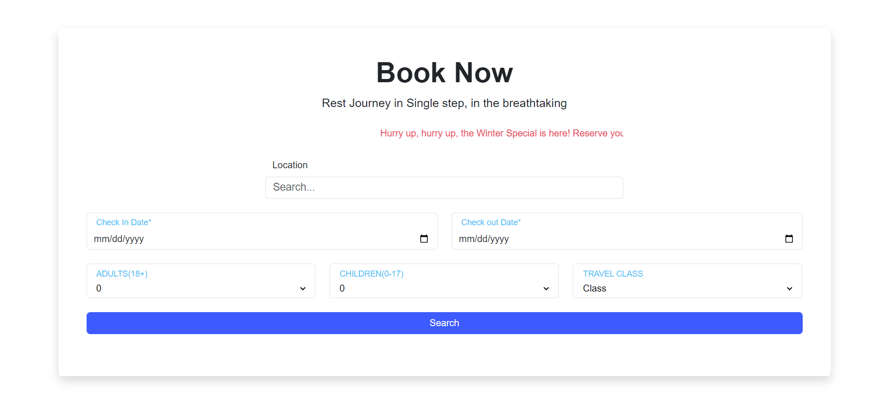
<h3>Rooms Section</h3>
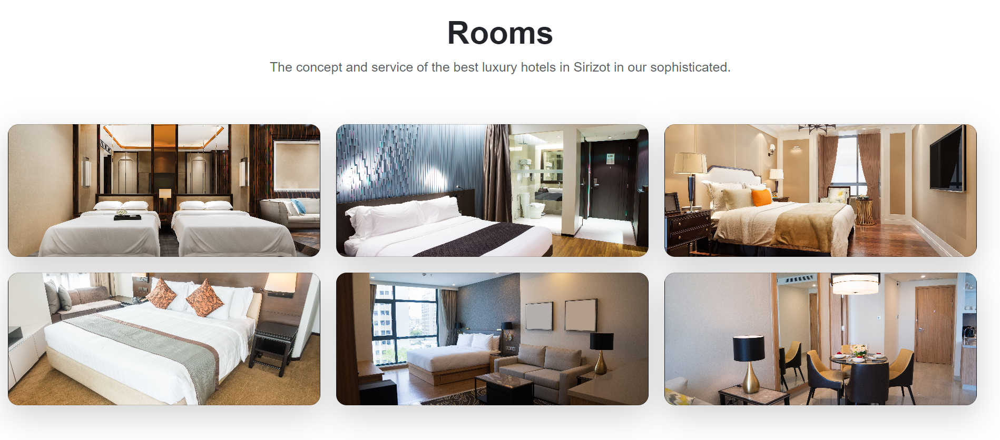
<h3>Rooms Pricing Section</h3>
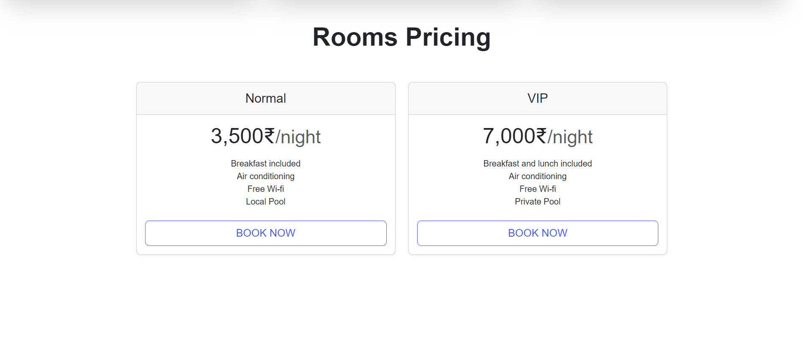
<h3>Events Section</h3>
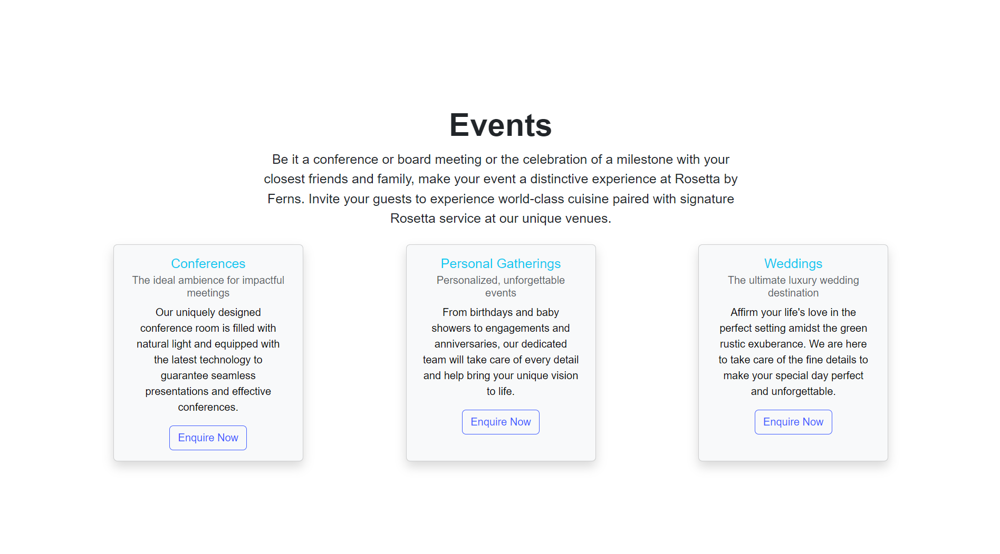
<h3>testmonial Section</h3>
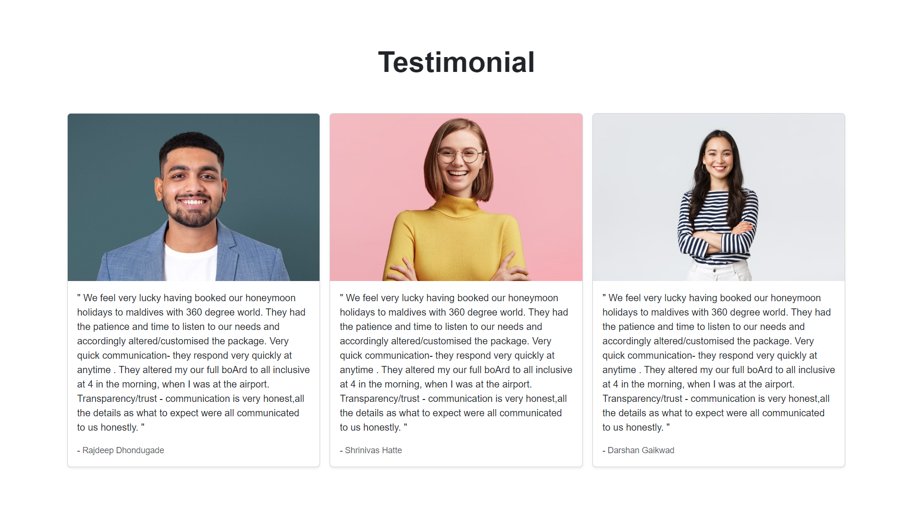
<h3>About Section</h3>

<h3>Venue Section</h3>
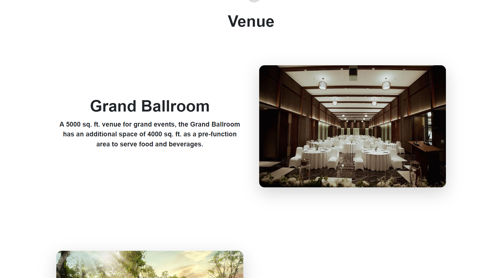
<h3>FAQ Section</h3>
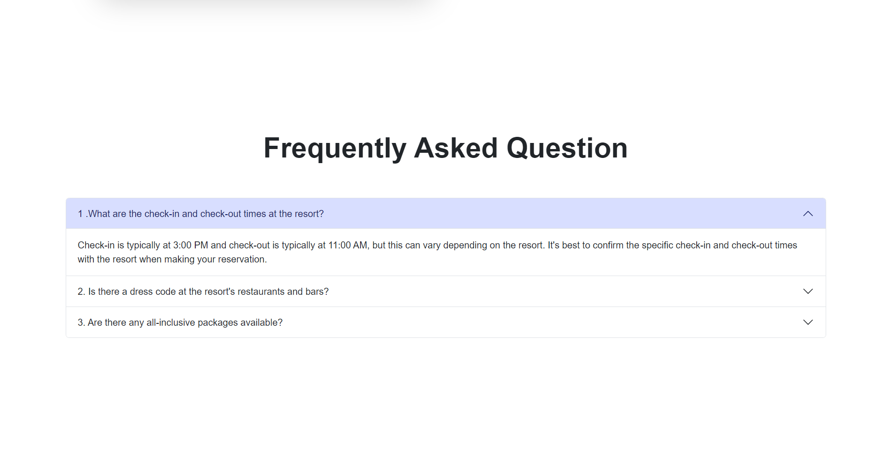
<h3>Contact Section</h3>
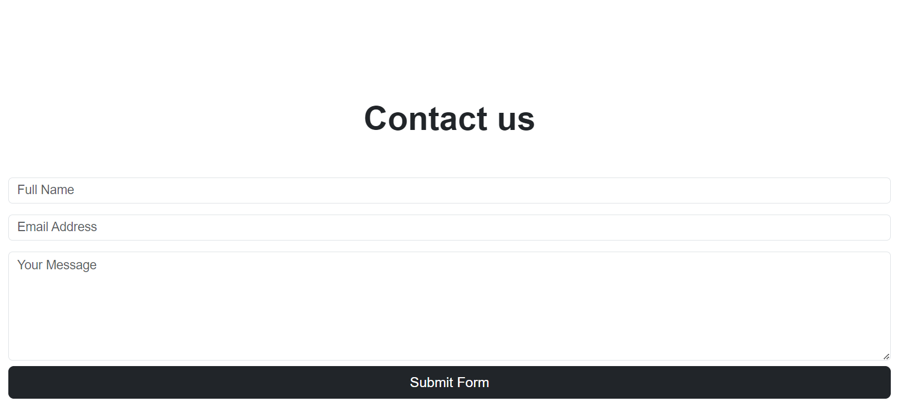
<h3>sign in Section</h3>
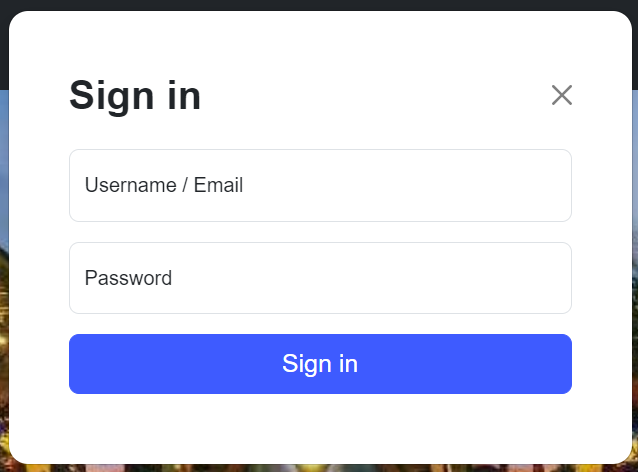
<h3>sign-up Section</h3>
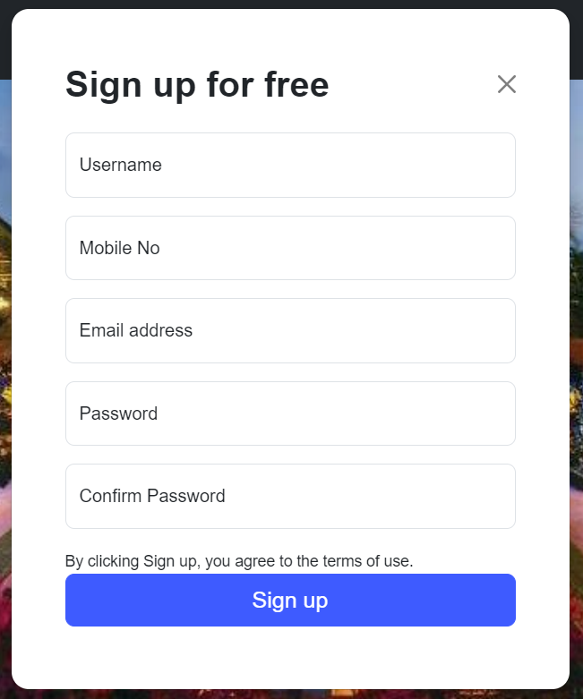
<h3>enquiry Section</h3>
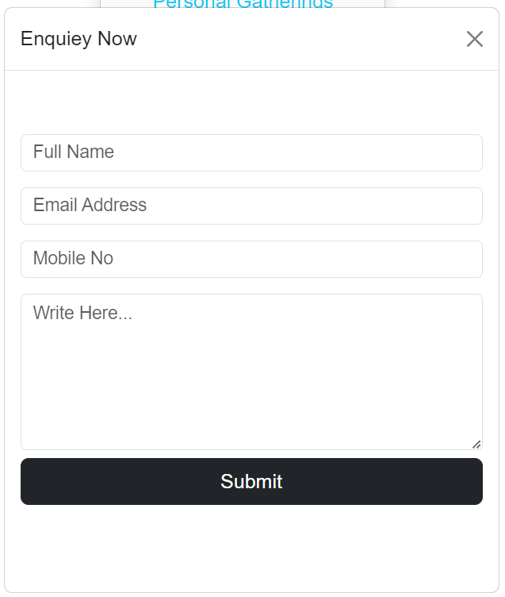
</div>

# ⚡Tech Used

<div align="center">
    
</div>

## 🚀 Getting Started

Clone the project

```bash
  git clone https://github.com/darshangaikwad4114/Resort-management-system.git
```

Go to the project directory

```bash
  cd Resort-management-system
```

Install dependencies

```bash
  npm install
```

Start the server

```bash
  npm run start
```

## ✊ Show your support

Give a ⭐️ if this project helped you!

# 📝License

[](https://github.com/darshangaikwad4114/Resort-management-system/blob/main/LICENCE)

# 🙌🏻 Feedback

If you have any feedback, please reach out to us at --> darshangaikwad4114@gmail.com

</div>
